## Hi there 👋
<table width="100%">
    <tr>
        <td colspan="2" align="center">
            <h2>Manish Pushkar</h2>
            
<strong>CMS Architect & Lead Developer — WordPress, Drupal, Magento, Sitecore & Shopify</strong>

            
I design scalable, API-first web platforms using WordPress, Contentful, Drupal, Sitecore and modern architectures. 

            
<strong>Trusted since 2012 • 70+ projects delivered worldwide</strong>

            
<a href="https://linkedin.com/in/manish-pushkar">LinkedIn</a> • <a href="https://behance.net/manishpushkar">Behance</a>

        </td>
    </tr>
    <tr>
        <td colspan="2">
            
Architect-level CMS expert with a strong track record of building enterprise-grade digital ecosystems. Experienced working with global organizations including Photon, Adobe, Google, GE Healthcare, and FHL Bank San Francisco.

        </td>
    </tr>
    <tr>
        <td valign="top" width="50%">
            <h3>Impact Snapshot</h3>
            <ul>
                <li>13+ years in CMS & Web Architecture</li>
                <li>100+ websites delivered across industries</li>
                <li>50+ WordPress themes & 20+ plugins built</li>
                <li>Expert in Headless CMS (Contentful + WordPress)</li>
                <li>Handled 100–500 daily API sync operations</li>
                <li>Enterprise & global client experience</li>
            </ul>
        </td>
        <td valign="top" width="50%">
            <h3>What I Build</h3>
            <ul>
                <li>Scalable CMS platforms</li>
                <li>Headless CMS architectures</li>
                <li>API-first systems</li>
                <li>Custom WordPress plugins & themes</li>
                <li>Automation workflows (Cron, WP CLI)</li>
                <li>Enterprise-grade platforms</li>
                <li>CRM & ERP</li>
            </ul>
        </td>
    </tr>
    <tr>
        <td valign="top" width="50%">
            <h3>Core Expertise</h3>
            <ul>
                <li><strong>CMS:</strong> WordPress, WordPress VIP, Drupal, Contentful, Sitecore</li>
                <li><strong>Commerce:</strong> WooCommerce, Shopify, Shopify Plus, Magento, OpenCart (B2B/ B2C, ERP (SAP), PIM & API Driven Integrations) </li>
                <li><strong>Architecture:</strong> Headless CMS, API-first systems, scalable content modeling</li>
                <li><strong>Development:</strong> PHP, JavaScript (ES6+), REST APIs, MySQL</li>
            </ul>
        </td>
        <td valign="top" width="50%">
            <h3>Infrastructure & DevOps</h3>
            <ul>
                <li>AWS, Azure, Google Cloud</li>
                <li>Cloudflare, CDN, Server Management</li>
                <li>WordPress VIP standards & architecture</li>
                <li>Git, Sonar, CI/CD workflows</li>
            </ul>
        </td>
    </tr>
    <tr>
        <td colspan="2">
            <h3>Key Achievements</h3>
            <ul>
                <li>Architected enterprise headless CMS platforms</li>
                <li>Built 20+ production-grade WordPress plugins</li>
                <li>Maintained high code quality (Sonar ~80%)</li>
                <li>Led end-to-end system architecture & delivery</li>
            </ul>
        </td>
    </tr>
    <tr>
        <td colspan="2">
            <h3>Experience</h3>
            <h4><strong>Photon</strong> — Technology Lead (Jul 2025 – Mar 2026, On-site)</h4>
            <ul>
                <li>Led architecture and development of enterprise CMS platforms (WordPress VIP, Contentful, Shopify Plus)</li>
                <li>Designed scalable headless CMS systems using Contentful and WordPress</li>
                <li>Improved system performance, automation, and API integrations</li>
                <li>Delivered high-impact solutions for global enterprise clients</li>
            </ul>
            
<strong>Tech/Tools:</strong> WordPress VIP, ACF Pro, PHP, GraphQL, Git, Docker, SonarCloud, Jira, Confluence, draw.io, Figma

            ---
            <h4><strong>Coredo OY</strong> — Software Architect (May 2022 – Mar 2025, Remote)</h4>
            <ul>
                <li>Built and managed CMS platforms using WordPress, Drupal, and Contentful</li>
                <li>Developed API-driven systems and scalable web applications</li>
                <li>Worked on projects including Lehtipiste, Kaivosvastuu, and Saas Instruments</li>
                <li>Focused on system architecture, performance optimization, and scalable delivery</li>
            </ul>
            
<strong>Tech/Tools:</strong> HTML5, CSS3, Bootstrap 5, WordPress, Drupal, Contentful, PHP, Ajax, REST API, GraphQL, Git, Jira, Confluence, Figma, Adobe XD

            ---
            <h4><strong>Tricon Infotech</strong> — Principal Engineer (May 2021 – Mar 2022, Remote)</h4>
            <ul>
                <li>Worked on large-scale enterprise publishing platform (Taylor & Francis)</li>
                <li>Handled complex WordPress development and enhancements</li>
                <li>Collaborated with cross-functional teams to deliver scalable solutions</li>
            </ul>
            ---
            <h4><strong>Adobe</strong> — Software Engineer II (Mar 2020 – Mar 2021, Contract, Remote)</h4>
            <ul>
                <li>Contributed to Adobe XD Ideas platform and marketing ecosystem</li>
                <li>Developed WordPress themes and integrated Contentful-based data systems</li>
                <li>Built weekly HTML newsletters based on Adobe XD design systems</li>
                <li>Collaborated with global teams across design, engineering, and publishing</li>
            </ul>
            ---
            <h4><strong>Opteamix</strong> — Senior Software Engineer (Jul 2018 – Nov 2019, On-site)</h4>
            <ul>
                <li>Developed CMS-driven platforms using WordPress, Drupal, and Contentful</li>
                <li>Worked on enterprise projects including FHLBank San Francisco and MyCarandBike</li>
                <li>Contributed to UI/UX improvements and backend architecture</li>
            </ul>
            ---
            <h4><strong>Magnetyz</strong> — Software Engineer (Jun 2016 – Jun 2018, On-site)</h4>
            <ul>
                <li>Built custom HTML templates, WordPress themes, and plugins from scratch</li>
                <li>Delivered 50+ projects across education, corporate, and eCommerce domains</li>
                <li>Developed landing pages and marketing assets for enterprise clients</li>
            </ul>
            ---
            <h4><strong>Brandstard</strong> — Software Engineer (Jan 2016 – May 2016, Remote)</h4>
            <ul>
                <li>Developed websites using WordPress, Magento, and custom PHP solutions</li>
                <li>Worked on eCommerce, real estate, and content-driven platforms</li>
                <li>Collaborated with marketing and design teams for delivery</li>
            </ul>
            ---
            <h4><strong>Prakyath Applications</strong> — Software Engineer (Dec 2014 – Dec 2015, On-site)</h4>
            <ul>
                <li>Built web applications and CMS platforms using PHP and WordPress</li>
                <li>Worked on real estate, news portal, and enterprise internal tools</li>
                <li>Developed scalable and user-focused digital solutions</li>
            </ul>
            ---
            <h4><strong>Quaarc Solutions</strong> — Software Engineer (Sep 2013 – Aug 2014, On-site)</h4>
            <ul>
                <li>Developed websites across multiple industries using WordPress and PHP</li>
                <li>Worked on corporate, event, and eCommerce platforms</li>
                <li>Built strong foundation in full-stack web development</li>
            </ul>
            ---
            <h4><strong>Sony</strong> — Intern (Jan 2013 – Jun 2013, On-site)</h4>
            <ul>
                <li>Developed a zip code-based store locator platform</li>
                <li>Built responsive UI and real-time search functionality</li>
                <li>Delivered user-friendly experience across devices</li>
            </ul>
        </td>
    </tr>
    </table>

---

# Selected Project Portfolio

A chronological record of selected professional projects and contributions.

| No. | Project Name | Employer | Industry / Domain | Platform | Role | Year |
| --- | --- | --- | --- | --- | --- | --- |
| 71 | Groundworks | Photon | Construction, Home Services, Enterprise CMS | WordPress VIP, WordPress, PHP | Technical Lead / Solution Architect | 2025–2026 |
| 70 | Mister Car Wash | Photon | Automotive Services, eCommerce, Customer Experience | Shopify Plus, WooCommerce, Shopify | Platform Solution Architect | 2025–2026 |
| 69 | WP Coredo Events Management Plugin | Coredo OY | WordPress Plugin | WordPress, PHP | WordPress Plugin Development/ Maintenance | 2022–2025 |
| 68 | Product 'stock update' subscription | Coredo OY | WordPress Plugin | WordPress, PHP | WordPress Plugin Development/ Maintenance | 2022–2025 |
| 67 | Solita Automated Product Importer | Coredo OY | WordPress Plugin | WordPress, PHP | WordPress Plugin Development/ Maintenance | 2022–2025 |
| 66 | SYNKAA Automated Media Importer | Coredo OY | WordPress Plugin | WordPress, PHP | WordPress Plugin Development/ Maintenance | 2022–2025 |
| 65 | Prego Booking | Coredo OY | Restaurants | WordPress, PHP | WordPress Website Development/ Maintenance | 2022–2025 |
| 64 | Prego Group | Coredo OY | Restaurants | WordPress, PHP | WordPress Website Development/ Maintenance | 2022–2025 |
| 63 | Puuni | Coredo OY | Environmental impact partner | WordPress, PHP | WordPress Website Maintenance | 2022–2025 |
| 62 | Heinon Tukku Oy | Coredo OY | Food & Beverages | WordPress, PHP | WordPress Website Maintenance | 2022–2025 |
| 61 | Freia Life | Coredo OY | Digital Service, personal Wellness | WordPress, PHP | WordPress Website Maintenance | 2022–2025 |
| 60 | Erkkeri | Coredo OY | Real Estate | WordPress, PHP | WordPress Website Maintenance | 2022–2025 |
| 59 | Enjoy Dr_nk | Coredo OY | Product | WooCommerce, WordPress, PHP | WordPress Website Development/ Maintenance | 2022–2025 |
| 58 | SAAS | Coredo OY | Product | WooCommerce, WordPress, PHP | WordPress/ WooCommerce Website Development/ Maintenance | 2022–2025 |
| 57 | Alertum | Coredo OY | Training | WordPress, PHP | WordPress Website Maintenance | 2022–2025 |
| 56 | Hogfors | Coredo OY | Product | WordPress, PHP | WordPress Website Development/ Maintenance | 2022–2025 |
| 55 | Lehtipiste | Coredo OY | Marketing | WordPress, PHP | WordPress Website Development/ Maintenance | 2022–2025 |
| 54 | Kaivosvastuu | Coredo OY | Mining, Exploration | WordPress, PHP | WordPress Website Development/ Maintenance | 2022–2025 |
| 53 | Taylor & Francis | Tricon Infotech | Education | WordPress, PHP | WordPress Website Development/ Maintenance | 2021–2022 |
| 52 | Adobe XD Newsletters | Adobe | Marketing | HTML • CSS • Visual Studio Code • Jira • Confluence | HTML Newsletter Developer | 2020–2021 |
| 51 | Adobe Marketing Scripts Manager WordPress Plugin | Adobe | WordPress Plugin | WordPress, PHP | WordPress Plugin Development/ Maintenance | 2020–2021 |
| 50 | Adobe Google reCAPTCHA v3 Integrator WordPress Plugin | Adobe | WordPress Plugin | WordPress, PHP | WordPress Plugin Development/ Maintenance | 2020–2021 |
| 49 | Adobe Brackets | Adobe | Code Editor, Product, Blog | WordPress, PHP | WordPress Website Development/ Maintenance | 2020–2021 |
| 48 | Adobe XD Ideas | Adobe | Digital Media, Product, Blog | WordPress, PHP | WordPress Website Development/ Maintenance | 2020–2021 |
| 47 | FHL Bank | Opteamix | Banking Services | Contentful, Drupal | Website Development/ Maintenance | 2018–2019 |
| 46 | Maximus | Opteamix | IT | HTML • CSS3 • Bootstrap 4 • JavaScript • Git • Visual Studio Code | Website Development/ Maintenance | 2018–2019 |
| 45 | My Car & Bike | Opteamix | IT | WordPress, PHP | WordPress Website Development/ Maintenance | 2018–2019 |
| 44 | Opteamix | Opteamix | IT | WordPress, PHP | WordPress Website Development/ Maintenance | 2018–2019 |
| 43 | Contentful Admin Panel | Magnetyz | CMS Migration & Editor Management, API Management | Contentful, PHP | Contentful Backend Development | 2016–2018 |
| 42 | Disable Gutenberg WordPress Plugin | Magnetyz | CMS Migration & Editor Management, WordPress Plugin Development | WordPress, PHP | WordPress Plugin Development | 2016–2018 |
| 41 | Presidency University | Magnetyz | Education | WordPress, PHP | WordPress Website Maintenance | 2016–2018 |
| 40 | HTML Landing Page Development | Magnetyz | Marketing | HTML5 | HTML Newsletter Development | 2016–2018 |
| 39 | Marketo Newsletter Development | Magnetyz | Marketing | HTML • CSS | HTML Newsletter Development | 2016–2018 |
| 38 | Presidency School Banashankari (PSBSK) | Magnetyz | Education | WordPress, PHP | WordPress Website Maintenance | 2016–2018 |
| 37 | Presidency School Yelahanka (PSBN) | Magnetyz | Education | WordPress, PHP | WordPress Website Maintenance | 2016–2018 |
| 36 | Presidency School Kasturi Nagar (PSBE) | Magnetyz | Education | WordPress, PHP | WordPress Website Maintenance | 2016–2018 |
| 35 | Presidency School Bilekahalli (PSBS) | Magnetyz | Education | WordPress, PHP | WordPress Website Maintenance | 2016–2018 |
| 34 | Presidency School Mangalore (PSMNG) | Magnetyz | Education | WordPress, PHP | WordPress Website Maintenance | 2016–2018 |
| 33 | St. Paul's English School JP Nagar (SPES) | Magnetyz | Education | WordPress, PHP | WordPress Website Maintenance | 2016–2018 |
| 32 | Presidency School RT Nagar (PSRTN) | Magnetyz | Education | WordPress, PHP | WordPress Website Maintenance | 2016–2018 |
| 31 | Presidency School Nandini Layout (PSNLO) | Magnetyz | Education | WordPress, PHP | WordPress Website Maintenance | 2016–2018 |
| 30 | Venkat International School | Magnetyz | Education | WordPress, PHP | WordPress Website Maintenance | 2016–2018 |
| 29 | Venus International School | Magnetyz | Education | WordPress, PHP | WordPress Website Maintenance | 2016–2018 |
| 28 | Archius | Magnetyz | Architectural studio | WordPress, PHP | WordPress Website Maintenance | 2016–2018 |
| 27 | Rapid Corp India | Magnetyz | Architectural studio | WordPress, PHP | WordPress Website Maintenance | 2016–2018 |
| 26 | Valfar | Magnetyz | Architectural studio | WordPress, PHP | WordPress Website Maintenance | 2016–2018 |
| 25 | Kalika Group | Magnetyz | Education, Agriculture | WordPress, PHP | WordPress Website Maintenance | 2016–2018 |
| 24 | Reem | Magnetyz | Food & Beverage | WordPress, PHP | WordPress Website Maintenance | 2016–2018 |
| 23 | Inter Digital | Magnetyz | IT, solutions, performance marketing & AI automation agency | WordPress, PHP | WordPress Website Maintenance | 2016–2018 |
| 22 | Hyfah | Magnetyz | Cosmetics | WordPress, PHP | WordPress Website Development from scratch | 2016–2018 |
| 21 | Savoury | Magnetyz | Food & Beverage | WordPress, PHP | WordPress Website Maintenance | 2016–2018 |
| 20 | Corcoran Solicitors | Brandstard | Solicitors | WordPress, HTML5 | WordPress Website Development/ Maintenance | 2016 |
| 19 | Pratham Developers | Brandstard | Real Estate | WordPress, HTML5 | WordPress Website Maintenance | 2016 |
| 18 | Alankruthi | Brandstard | Jewellery Store, eCommerce, Online Shop | Magento, HTML5 | Magento Website Development from Theme Customization | 2016 |
| 17 | Shaadi ki Biryani | Brandstard | Food & Beverage | WooCommerce, WordPress, HTML5 | WordPress Website Development from Theme Customization | 2016 |
| 16 | YFF Foreign Policy | Brandstard | International Relations | WordPress, HTML5 | WordPress Website Development from Theme Customization | 2016 |
| 15 | Vivansaa | Brandstard | Real Estate | WordPress, HTML5 | WordPress Website Maintenance | 2016 |
| 14 | Brandstard | Brandstard | IT, Digital Services | WordPress, HTML5 | WordPress Website Development from Theme Customization | 2016 |
| 13 | Pocket College | Prakyath Applications | Education | PHP, HTML5 | Website Application Maintenance | 2014–2015 |
| 12 | My Kannada Classics | Prakyath Applications | Entertainment | WordPress, HTML5 | WordPress Website Development from scratch | 2014–2015 |
| 11 | Latest Trailerz | Prakyath Applications | Entertainment | WordPress, HTML5 | WordPress Website Development from scratch | 2014–2015 |
| 10 | Prakyath Group | Prakyath Applications | IT & Real Estate | WordPress, HTML5 | WordPress Website Development from scratch | 2014–2015 |
| 9 | Prakyath Edifice | Prakyath Applications | Real Estate | WordPress, HTML5 | WordPress Website Development from Theme Customization | 2014–2015 |
| 8 | School Management System Web Application | Quaarc Solutions | Education | Asp.Net, HTML5 | Website Application Maintenance | 2013–2014 |
| 7 | RR Wedding and Events | Quaarc Solutions | Event Organizers and Planners | PHP, HTML5 | WordPress Website Development from Theme Customization | 2013–2014 |
| 6 | SunWood Business Apartments | Quaarc Solutions | Business Apartments | HTML5 | HTML Website Development from PSD | 2013–2014 |
| 5 | Adamma | Quaarc Solutions | Background Verification | PHP, HTML5 | PHP Website Development from PSD | 2013–2014 |
| 4 | Teachers Academy Website | Quaarc Solutions | Education | Asp.Net, HTML5 | Website Maintenance | 2013–2014 |
| 3 | Teachers English Academy Website | Quaarc Solutions | Education | PHP, HTML5 | PHP Website Development from PSD | 2013–2014 |
| 2 | Quaarc Solutions Official Website | Quaarc Solutions | IT Services | HTML4/5 • CSS3 • OS Class UI • Git • Visual Studio | Website Maintenance | 2013–2014 |
| 1 | Sony Official Website | Sony | Entertainment | HTML4/5 • CSS3 • JavaScript • Table Layout • Notepad++ • Atom | Website Maintenance | 2013 |

---

## Web Applications & CRM / ERP Products

The following web applications were independently architected, designed, developed, tested, and iterated as solo CRM/ERP and web application projects, with AI-assisted development workflows using ChatGPT.

| No. | Application Name | Description | Tools & Technologies | Role | Project Year |
| ---: | --- | --- | --- | --- | --- |
| 1 | Dental Practice Management System | Complete dental clinic CRM for patients, appointments, FDI dental charts, treatments, prescriptions, estimates, invoices, inventory, doctors, receptionists, payroll, documents, reports, and patient portal. | PHP, PDO, MySQL, HTML5, CSS3, JavaScript, AJAX, Bootstrap, REST/API-ready architecture | Solo CRM / ERP Developer & Solution Architect | 2026 |
| 2 | P&C Insurance Management System | Insurance CRM for managing policyholders, agents, brokers, policies, renewals, claims, documents, payments, and operational records. | PHP, PDO, MySQL, HTML5, CSS3, JavaScript, AJAX, Bootstrap | Solo CRM Developer & Solution Architect | 2026 |
| 3 | Solo Gynae Clinic Management System | Women’s health clinic CRM covering patients, appointments, ANC/pregnancy records, clinical notes, treatment plans, prescriptions, invoices, reports, and patient portal. | PHP, PDO, MySQL, HTML5, CSS3, JavaScript, AJAX, Bootstrap, Email Queue | Solo Healthcare CRM Developer | 2026 |
| 4 | Solo Eye Clinic Management System | Eye-clinic web application for patient records, appointments, eye examinations, prescriptions, invoices, payments, follow-ups, reports, and patient access. | PHP, PDO, MySQL, HTML5, CSS3, JavaScript, AJAX, Bootstrap | Solo Healthcare CRM Developer | 2026 |
| 5 | Solo Professional Business Manager | Professional-services CRM for projects, milestones, quotations, invoices, payments, files, clients, multi-user access, financial visibility, and activity/login tracking. | PHP, PDO, MySQL, HTML5, CSS3, JavaScript, AJAX, Bootstrap, PDF Generation | Solo CRM / Business Application Developer | 2026 |
| 6 | Company Careers Recruitment Management System | Recruitment/ATS application for job openings, applicants, applications, interviews, talent pools, HR users, permissions, notifications, and candidate workflows. | PHP, PDO, MySQL, HTML5, CSS3, JavaScript, AJAX, Bootstrap, Email Queue | Solo Recruitment Platform Developer | 2026 |
| 7 | Recruitment & Career Platform with Public Jobs API | Recruitment platform combining internal hiring operations, public career portal, candidate accounts, application pipeline, interviews, offers, talent pool, reporting, audit history, and a public jobs API. | PHP, PDO, MySQL, REST API, HTML5, CSS3, JavaScript, AJAX, Bootstrap | Solo Recruitment CRM / API Developer | 2026 |
| 8 | Travel Agent CRM | Travel operations CRM for accommodations, itineraries, activities, flights, bookings, suppliers, customer records, reports, calendars, and itinerary sharing. | PHP, PDO, MySQL, HTML5, CSS3, JavaScript, AJAX, Bootstrap | Solo Travel CRM Developer | 2026 |
| 9 | Engineering Operations Suite | ERP-style operations platform for engineering businesses, combining operational records, projects, resources, workflows, reporting, and administrative controls. | PHP, PDO, MySQL, HTML5, CSS3, JavaScript, AJAX, Bootstrap | Solo ERP Developer & Solution Architect | 2026 |
| 10 | Architect Office Management System | Architecture-office ERP for clients, projects, drawings, approvals, site visits, staff, payroll, invoices, documents, and client/staff portals. | PHP, PDO, MySQL, Bootstrap, JavaScript, HTML5, CSS3, PDF Generation | Solo ERP Developer & Solution Architect | 2026 |
| 11 | Foundation Inspection & Project Management System | Field/project management CRM for foundation inspection workflows, projects, client information, inspection records, documentation, and operational tracking. | PHP, PDO, MySQL, HTML5, CSS3, JavaScript, AJAX, Bootstrap | Solo CRM / Project Systems Developer | 2026 |
| 12 | Restaurant Multi-Outlet Management System | Multi-location restaurant operations CRM for outlets, staff, operational records, customers, reporting, and centralized management. | PHP, PDO, MySQL, HTML5, CSS3, JavaScript, AJAX, Bootstrap | Solo ERP / Operations Developer | 2026 |
| 13 | Car Wash Management System | Multi-outlet car-wash platform with customers, bookings, memberships, outlets, employees, salary settings, customer portal, and reports. | PHP, PDO, MySQL, HTML5, CSS3, JavaScript, AJAX, Bootstrap | Solo Business Application Developer | 2026 |
| 14 | Renewable Energy ESG Management System | CRM/ERP platform for renewable-energy and ESG-related operational records, projects, reporting, compliance information, and business workflows. | PHP, PDO, MySQL, HTML5, CSS3, JavaScript, AJAX, Bootstrap | Solo CRM / ERP Developer | 2026 |
| 15 | Advocate Office Management System | Legal-office CRM for clients, matters/cases, documents, schedules, billing, activities, and administrative workflows. | PHP, PDO, MySQL, HTML5, CSS3, JavaScript, AJAX, Bootstrap | Solo Legal CRM Developer | 2026 |
| 16 | CA Office Management System | Practice-management CRM for accounting/CA offices to organize clients, assignments, documents, deadlines, billing, and internal workflows. | PHP, PDO, MySQL, HTML5, CSS3, JavaScript, AJAX, Bootstrap | Solo Professional Services CRM Developer | 2026 |
| 17 | Child Specialist Management System | Pediatric clinic management application for patients, appointments, clinical information, prescriptions, billing, follow-ups, and clinic operations. | PHP, PDO, MySQL, HTML5, CSS3, JavaScript, AJAX, Bootstrap | Solo Healthcare CRM Developer | 2026 |
| 18 | Online Photo Print Studio Management System | Web application for photo-print studio operations, customer orders, uploads, order processing, pricing, status tracking, and administration. | PHP, PDO, MySQL, HTML5, CSS3, JavaScript, AJAX, Bootstrap | Solo Web Application Developer | 2026 |
| 19 | Gym Membership Management System | Gym CRM for members, memberships, plans, payments, attendance, renewals, staff, and operational reporting. | PHP, PDO, MySQL, HTML5, CSS3, JavaScript, AJAX, Bootstrap | Solo CRM Developer | 2026 |
| 20 | Job Board Management System | Employer/applicant job platform for job publishing, employer accounts, applicants, applications, profiles, and recruitment workflows. | PHP, PDO, MySQL, HTML5, CSS3, JavaScript, AJAX, Bootstrap | Solo Job Platform Developer | 2026 |
| 21 | Tutor CRM | Tutor-focused CRM for students, appointments/classes, records, payments, communication, and administrative management. | PHP, PDO, MySQL, HTML5, CSS3, JavaScript, AJAX, Bootstrap | Solo Education CRM Developer | 2026 |
| 22 | Roadside Assistance ERP | Operations ERP concept/development for roadside-assistance businesses covering customers, service requests, vehicles, dispatch, providers, jobs, payments, and reporting. | PHP, PDO, MySQL, HTML5, CSS3, JavaScript, AJAX, Bootstrap | Solo ERP / Operations Developer | 2026 |
| 23 | Event Booking Web Application | Responsive event-booking platform with a mobile-app-style experience for event discovery, booking workflows, users, and administration. | PHP, PDO, MySQL, HTML5, CSS3, JavaScript, AJAX | Solo Full-Stack Web Application Developer | 2026 |
| 24 | Wedding RSVP Web Application | Self-hosted RSVP application with guest responses, event information, administration, and installer-based deployment. | PHP, PDO, MySQL, HTML5, CSS3, JavaScript | Solo Full-Stack Web Application Developer | 2026 |
| 25 | LeadPulse Marketing Platform | Marketing/lead-management application focused on lead organization, customer workflows, campaign-oriented operations, and business follow-up. | PHP, PDO, MySQL, HTML5, CSS3, JavaScript, AJAX, REST API | Solo CRM / Marketing Platform Developer | 2026 |

---

### Content Update & Removal Requests

This portfolio is maintained in good faith based on my professional contributions. If you represent a client or organization and wish to request an update, correction, anonymization, or removal of any project information, please contact me at [hello@manishpushkar.com](mailto:hello@manishpushkar.com).

<table width="100%">
<tr>
        <td colspan="2" align="center">
            <h3>Courses & Certifications</h3>
        </td>
    </tr>
    <tr>
        <td colspan="2" align="left">
            <h3>Government</h3>
        </td>
    </tr>
    <tr>
        <td valign="top" width="50%">
            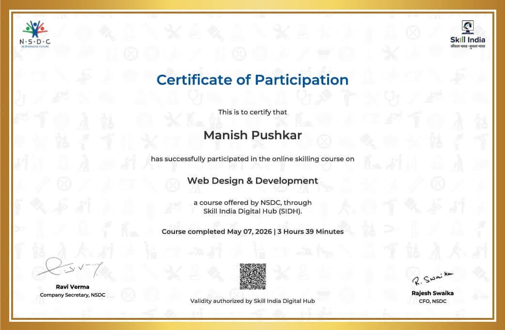
        </td>
        <td valign="top" width="50%">
            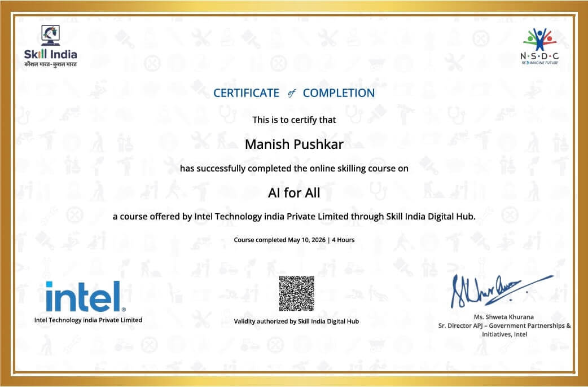
        </td>
    </tr>
    <tr>
        <td colspan="2" align="left">
            <h3>Design</h3>
        </td>
    </tr>
    <tr>
        <td valign="top" width="50%">
            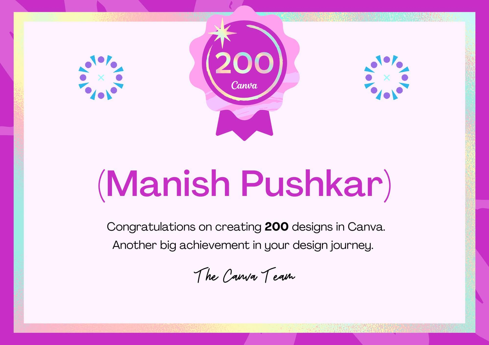
        </td>
        <td valign="top" width="50%">
            
        </td>
    </tr>
    <tr>
        <td colspan="2" align="left">
            <h3>WordPress/ WordPress VIP CMS</h3>
        </td>
    </tr>
    <tr>
        <td valign="top" width="50%">
            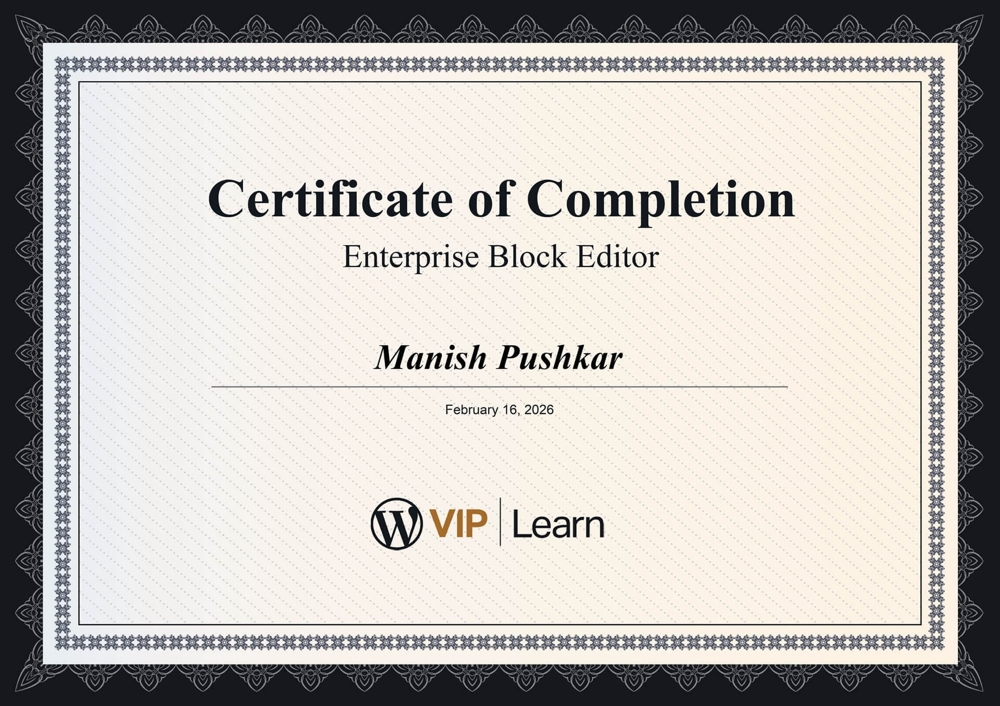
        </td>
        <td valign="top" width="50%">
            
        </td>
    </tr>
    <tr>
        <td colspan="2" align="left">
            <h3>Contentful CMS</h3>
        </td>
    </tr>
    <tr>
        <td valign="top" width="50%">
            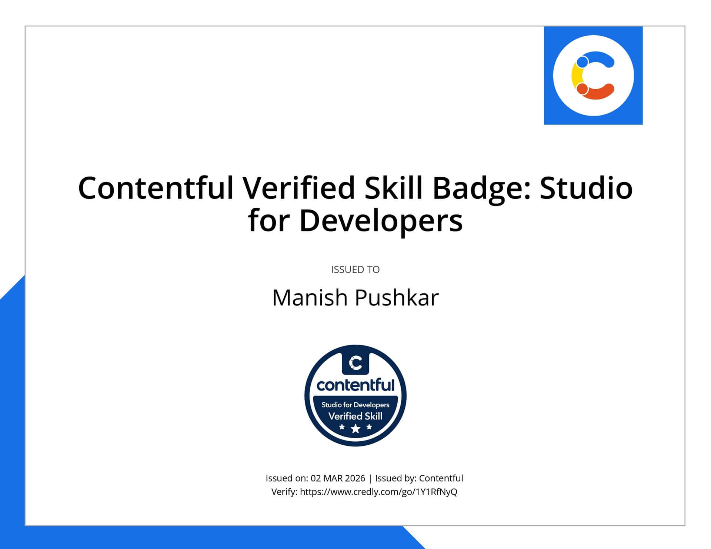
        </td>
        <td valign="top" width="50%">
            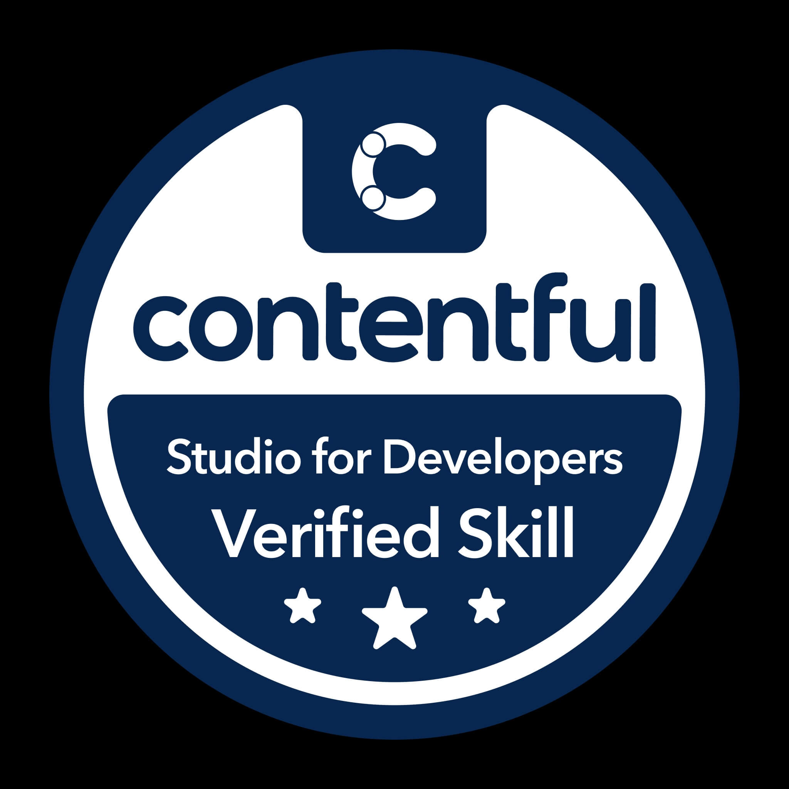
        </td>
    </tr>
    <tr>
        <td colspan="2" align="left">
            <h3>Calude AI</h3>
        </td>
    </tr>
    <tr>
        <td valign="top" width="50%">
            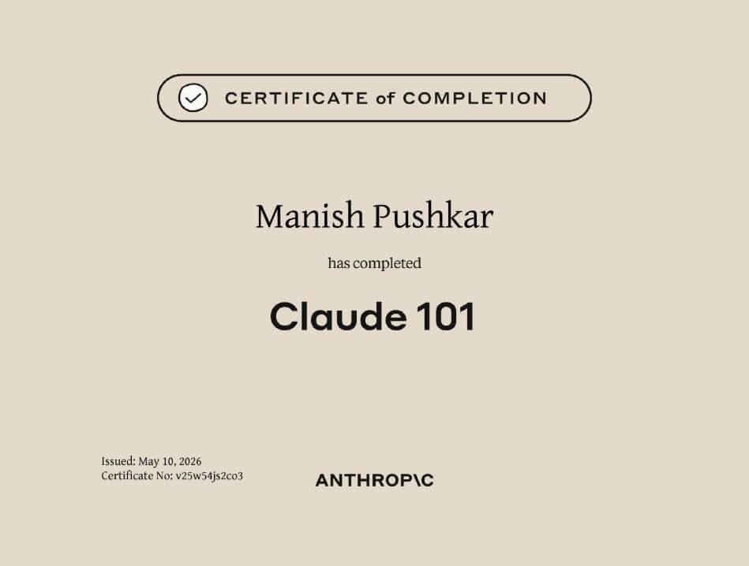
        </td>
        <td valign="top" width="50%">
            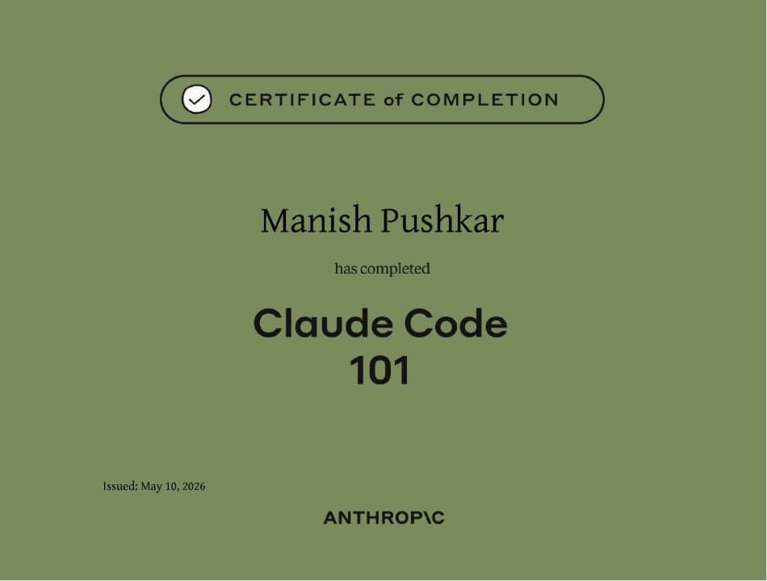
        </td>
    </tr>
    <tr>
        <td valign="top" width="50%">
            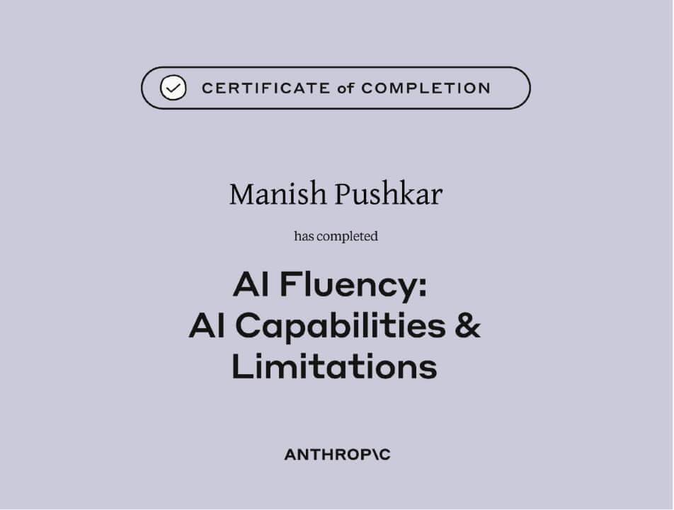
        </td>
        <td valign="top" width="50%">
            
        </td>
    </tr>
    <tr>
        <td colspan="2" align="left">
            <h3>Microsoft AI</h3>
        </td>
    </tr>
    <tr>
        <td valign="top" width="50%">
            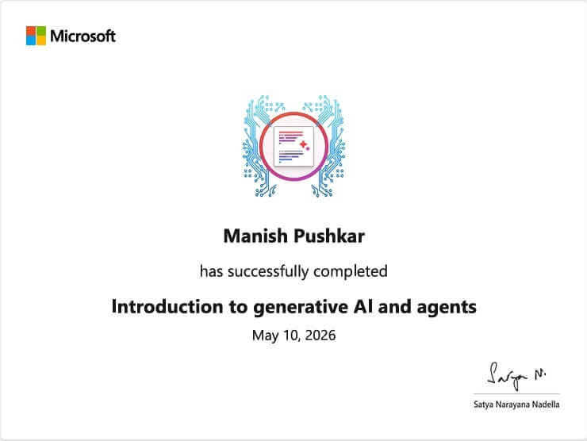
        </td>
        <td valign="top" width="50%">
            
        </td>
    </tr>
    <tr>
        <td colspan="2" align="left">
            <h3>Project management</h3>
        </td>
    </tr>
    <tr>
        <td valign="top" width="50%">
            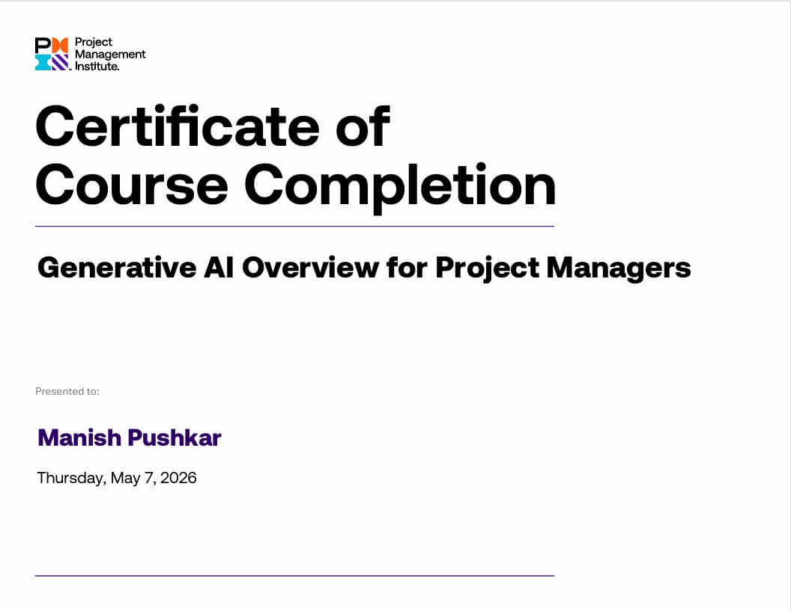
        </td>
        <td valign="top" width="50%">
            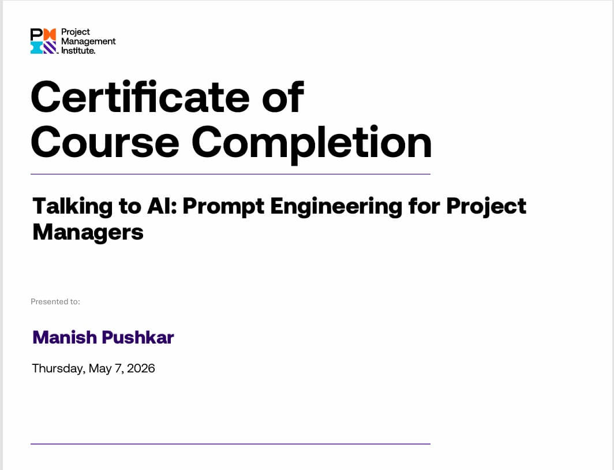
        </td>
    </tr>
    <tr>
        <td colspan="2" align="center">
            <h3>Let's Connect</h3>
            
<em>Project links or implementation details may be intentionally omitted due to confidentiality agreements and client/employer policies. I'm happy to discuss specifics where permitted.</em>

            
Explore my repositories below or connect for collaboration opportunities.

            
<a href="mailto:iammanishpushkar@gmail.com">Email</a>

        </td>
    </tr>
</table>
